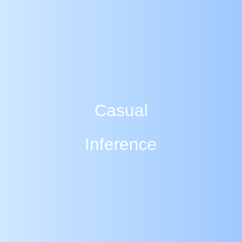

# Casual Inference

{width=220px}

> Hello — I'm Jonathan Pearce. I work on causal inference, applied statistics, and reproducible data science. This site contains my projects, blog posts, and useful resources.

- GitHub: [@Jonathan-Pearce](https://github.com/Jonathan-Pearce){target="_blank"}
- LinkedIn: [LinkedIn profile](https://www.linkedin.com/in/YOUR-LINKEDIN){target="_blank"}

## Featured Projects

- Project A — short description. See the [Projects tab](projects/index.qmd).

## Latest Posts

- [Welcome to Casual Inference](posts/2025-11-16-welcome.qmd)
